# Schema reference

Database target name: `plaa_service`; tested baseline PostgreSQL 16.10. Seven ordered migrations create **37 project tables** (26 `plaa`, 3 `ingest`, 8 `export`), plus installer-owned `public.schema_migration`. Extensions `pgcrypto` and `btree_gist` precede dependencies. `plaa_owner` owns project objects; no runtime role owns tables or bypasses RLS.

## Entities and mutable projections

| Group | Entities | Lifecycle |
|---|---|---|
| Membership | `member`, `member_identity` | Generated numeric `aa_id`; external UUID `public_id`; verified temporal typed identities. Status and interval closure use admin APIs and audit. |
| Catalog | `region`, `asset`, `category`, `activity`, `activity_point_value` | Manual region/asset maintenance, no Directory catalog import. Typed enums for cadence/verification. Soft retirement flags; versioned point schedules permit only audited open-end closure and successor creation. |
| Round config | `round`, `round_category_allocation`, `round_activity`, `round_region` | Nonoverlapping finite half-open rounds, weights (7,6), amounts (20,8). Allocation snapshot preserved in every settlement input manifest. |
| Intake and points | `activity_submission`, `point_event`, `point_correction_manifest`, `kudos_policy` | Raw-first submission processing; final review and credit atomic. All point effects have stable source/ref/effect and event time. Corrections append reversal plus optional replacement. No runtime policy approval. |
| Holdings | `settlement_batch`, `round_category_result`, `round_category_current`, `ir_current`, `plaa_ledger_entry` | Batch/results/ledger immutable. IA result composite FK and current pointer; per-round IR pointer. Corrective sets reverse prior effective issuances and post confirmed replacements atomically. |
| Bids | `buyback_auction`, `buyback_bid` | Raw immutable quantity-v1 facts. Nullable source amount; validated bid revision link. Auction number and optional round unique. No fill/clearing/holdings calculation. |
| Trust | `trust_holding_snapshot`, `trust_valuation_snapshot` | Distinct team quantities and Trust-supplied values; immutable sequential same-month/key revision chains. |
| Security/evidence | `audit_log`, `request_context` | Audit append-only from first domain write. Context is protected transaction-specific authorization state, not a member-set variable. |
| Restricted ingest | `source_manifest`, `raw_submission`, `identity_crosswalk` | Stable source identity + original occurrence/received time/hash/revision/request payload. Raw processing status/error is audited mutable state. Crosswalk is staging-only pending/confirmed/rejected evidence, never a second member key. |
| Export | `release_contract` and seven named release tables | Contract pending-only; release tables empty; no writer grants to runtime roles and builder fails closed. No participant FKs or IDs in release surfaces. |

## ERD

Names with `ingest_` / `export_` prefixes represent those schemas; all other nodes are `plaa`. Attributes below show keys/important lineage, not every column. Edges represent actual FK relationships; audit captures generic JSON evidence rather than an FK to every audited table. Export release tables intentionally have **no** relational escape to member-grain data.

```mermaid
erDiagram
    member {
        bigint aa_id PK
        uuid public_id UK
        text region_code FK
    }
    member_identity {
        bigint member_identity_id PK
        bigint aa_id FK
        text id_type
        text id_value
        date valid_from
        date valid_to
        boolean verified
    }
    region {
        text region_code PK
    }
    asset {
        text asset_code PK
    }
    category {
        bigint category_id PK
    }
    activity { bigint activity_id PK
        bigint category_id FK
    }
    activity_point_value { bigint activity_point_value_id PK
        bigint activity_id FK
        date valid_from
        date valid_to
        numeric points_default
    }
    round { bigint round_id PK
        int round_number UK
        daterange period
    }
    round_category_allocation { bigint round_id PK,FK
        bigint category_id PK,FK
        numeric weight
        numeric plaa_allocated
    }
    round_activity { bigint round_id PK,FK
        bigint activity_id PK,FK
    }
    round_region { bigint round_id PK,FK
        text region_code PK,FK
    }
    activity_submission { bigint submission_id PK
        bigint aa_id FK
        bigint activity_id FK
        bigint round_id FK
        bigint manifest_id FK,UK
    }
    point_event { bigint point_event_id PK
        bigint aa_id FK
        bigint round_id FK
        bigint activity_id FK
        bigint submission_id FK
        bigint activity_point_value_id FK
        bigint reverses_event_id FK,UK
        bigint manifest_id FK
    }
    point_correction_manifest { bigint correction_id PK
        bigint manifest_id FK,UK
        bigint original_event_id FK,UK
    }
    kudos_policy { text policy_version PK
        text mode
        boolean synthetic_only
    }
    settlement_batch { bigint settlement_batch_id PK
        bigint round_id FK
        bigint predecessor_batch_id FK
        bigint manifest_id FK,UK
        jsonb input_manifest
    }
    round_category_result { bigint settlement_batch_id PK,FK
        bigint category_id PK,FK
        bigint round_id FK
        bigint predecessor_batch_id FK
    }
    round_category_current { bigint round_id PK,FK
        bigint category_id PK,FK
        bigint settlement_batch_id FK
    }
    ir_current { bigint round_id PK,FK
        bigint settlement_batch_id FK
    }
    plaa_ledger_entry { bigint entry_id PK
        bigint aa_id FK
        bigint round_id FK
        bigint settlement_batch_id FK
        bigint category_id FK
        bigint reverses_entry_id FK,UK
        bigint manifest_id FK
        timestamptz effective_at
        timestamptz created_at
    }
    buyback_auction { bigint auction_id PK
        bigint round_id FK,UK
        bigint manifest_id FK,UK
    }
    buyback_bid { bigint bid_id PK
        bigint auction_id FK
        bigint aa_id FK
        bigint manifest_id FK,UK
        bigint supersedes_bid_id FK,UK
        numeric bid_amount_usd
    }
    trust_holding_snapshot { bigint holding_snapshot_id PK
        date snapshot_month
        text asset_code FK
        int revision
        bigint supersedes_snapshot_id FK,UK
        bigint manifest_id FK,UK
    }
    trust_valuation_snapshot { bigint valuation_snapshot_id PK
        date reporting_month
        int revision
        bigint supersedes_snapshot_id FK,UK
        bigint manifest_id FK,UK
    }
    audit_log { bigint audit_id PK
        text database_principal
        text actor
        bigint transaction_id
        text correlation
    }
    request_context { int backend_pid PK
        bigint transaction_id PK
        bigint aa_id FK
    }
    ingest_source_manifest { bigint manifest_id PK
        text source
        text source_ref
        int source_revision
        text content_hash
        timestamptz source_occurred_at
        timestamptz received_at
    }
    ingest_raw_submission { bigint raw_id PK
        bigint manifest_id FK,UK
    }
    ingest_identity_crosswalk { bigint crosswalk_id PK
        bigint manifest_id FK,UK
        bigint aa_id FK
        text status
    }
    export_release_contract { text contract_version PK
        text status
    }
    export_round_summary {
        int round_number PK
    }
    export_round_category_metrics { int round_number PK
        text category_code PK
    }
    export_activity_engagement { int round_number PK
        text activity_code PK
    }
    export_buyback_bid_summary {
        int auction_number PK
    }
    export_trust_holdings { date month PK
        text asset_code PK
    }
    export_program_growth {
        date month PK
    }
    export_trust_valuation {
        date month PK
    }

    region o|--o{ member : region
    member ||--o{ member_identity : identities
    category ||--o{ activity : classifies
    activity ||--o{ activity_point_value : schedule
    round ||--o{ round_category_allocation : configures
    category ||--o{ round_category_allocation : allocated
    round ||--o{ round_activity : incentivizes
    activity ||--o{ round_activity : enabled
    round ||--o{ round_region : unlocks
    region ||--o{ round_region : included
    member ||--o{ activity_submission : submits
    activity ||--o{ activity_submission : instantiates
    round ||--o{ activity_submission : receives
    member ||--o{ point_event : receives
    round ||--o{ point_event : contains
    activity ||--o{ point_event : activity
    round_activity ||--o{ point_event : permitted_pair
    activity_submission o|--o{ point_event : generates
    activity_point_value o|--o{ point_event : applied_version
    point_event o|--o| point_event : reverses
    point_event ||--o| point_correction_manifest : correction_evidence
    round o|--o{ settlement_batch : sources
    settlement_batch o|--o{ settlement_batch : predecessor
    settlement_batch ||--o{ round_category_result : produces
    category ||--o{ round_category_result : result_category
    round_category_allocation ||--o{ round_category_result : configured_pair
    round_category_result o|--o{ round_category_result : predecessor
    round_category_result ||--o| round_category_current : exact_effective_result
    round ||--o| ir_current : effective_ir
    settlement_batch ||--o| ir_current : exact_round_batch
    member ||--o{ plaa_ledger_entry : holdings
    round o|--o{ plaa_ledger_entry : round
    settlement_batch o|--o{ plaa_ledger_entry : exact_round_source
    round_category_result o|--o{ plaa_ledger_entry : category_result
    plaa_ledger_entry o|--o| plaa_ledger_entry : reverses
    round o|--o| buyback_auction : auction
    buyback_auction ||--o{ buyback_bid : receives
    member ||--o{ buyback_bid : places
    buyback_bid o|--o| buyback_bid : revision
    asset ||--o{ trust_holding_snapshot : asset
    trust_holding_snapshot o|--o| trust_holding_snapshot : predecessor
    trust_valuation_snapshot o|--o| trust_valuation_snapshot : predecessor
    member ||--o{ request_context : bound_member
    member o|--o{ ingest_identity_crosswalk : reviewed_match
    ingest_source_manifest ||--o| ingest_identity_crosswalk : evidence
    ingest_source_manifest ||--o| ingest_raw_submission : lands
    ingest_source_manifest ||--o| activity_submission : processes
    ingest_source_manifest ||--o{ point_event : effects
    ingest_source_manifest ||--o| point_correction_manifest : correction
    ingest_source_manifest ||--o| settlement_batch : calculation_inputs
    ingest_source_manifest ||--o{ plaa_ledger_entry : posting_provenance
    ingest_source_manifest ||--o| buyback_auction : auction_source
    ingest_source_manifest ||--o| buyback_bid : bid_source
    ingest_source_manifest ||--o| trust_holding_snapshot : team_source
    ingest_source_manifest ||--o| trust_valuation_snapshot : trust_source
```

## Read surfaces and privileges

- `v_member_round_points`: sum all points, including compensations.
- `v_member_balance`: all ledger entries; IA/IR/unallocated net components sum exactly to total.
- `balance_as_of(effective_cutoff, known_cutoff DEFAULT infinity)`: effective-as-of includes later-known corrections; finite known cutoff additionally excludes later-recorded entries. `created_at` is transaction recording time, not source time. PostgreSQL transaction rollback removes associated audit entries; audit IDs can have gaps.
- `v_quantity_bid`: only quantity-v1; source `bid_amount_usd` remains nullable; separately named exact multiplication `calculated_notional_usd` is not source truth or holdings.
- Trust current views and `holdings_as_reported`/`valuation_as_reported` preserve original rows. Admin `trust_report` provides a bounded-purpose definer surface. Quantity as-reported uses created time; valuation additionally respects supplied received time.
- `review_queue`, `audit_page(after_id)` and triage queues have fixed queries/100-row page limits; `settlement_reconciliation(round)` compares current confirmed results against **all-history net** holdings. No caller-provided SQL/table selector.

Member-grain base tables **and** views are protected: every core/ingest table has ENABLE + FORCE RLS; member SELECT policies are limited to the current protected binding, catalog SELECT policies expose program config only. Other core/ingest tables have only the explicit migration-owner policy. Backend has only bind execution and NOINHERIT membership permitting `SET LOCAL ROLE plaa_member_reader`. Export reader has only schema usage and seven explicit table SELECT grants. No future-table/default SELECT grants exist.

Kudos policy reference is retained/validated in immutable manifest JSON, not an ERD FK column. The same applies to generic source correction context in audit. These logical references should not be mistaken for participant export relationships.

## Integrity boundary

Runtime ingestion/review/settlement writes cannot bypass restricted functions with direct DML. Point and ledger reversal triggers enforce exact original linkage and opposite amounts; unique indexes reject a second reversal. Deferred IA result reconciliation runs with protected definer privileges at commit. Trust/key checks and atomic complete issuance checks are enforced by the only runtime write APIs, with uniqueness/composite FKs as additional defenses. Migration owner/superuser can change DDL, disable triggers or defeat policies: “append-only” is a runtime contract, not physically immutable storage or malicious-owner protection.
